  

<!-- Title -->
<h3 align="center">
    <samp>
        &gt; AI Agent & Human Workflow • Vibe Coding • Fullstack Developer
    </samp>
</h3>

 

  

### 👨‍💻 About Me

A passionate <b>Fullstack Developer</b> based in <b>Yangon, Myanmar</b>, with a deep interest in <b>AI Technology, Mathematical Computations, and Statistics</b>. I specialize in building web applications using modern technologies like Next.js, React, Supabase, and TailwindCSS. I am constantly exploring new technologies and currently diving into AI Agentic Workflows & Vibe Coding.

- 🚀 **Current Focus:** Working on **[The Notebook](#) & other cool projects**.
- 🌱 **Currently Learning:** AI Agentic Workflows & Vibe Coding.
- 💬 **Ask me about:** Next.js, React, Supabase, and TailwindCSS.
- 📫 **How to reach me:** [yeaung.com](https://yeaung.com).

 

### 🛠️ Technical Arsenal

<table align="center" border="0" cellspacing="10" cellpadding="10" width="100%">
  <tr>
    <td align="center" width="33%" valign="top">
      <h4>Frontend Development</h4>
       
        
      <code>Next.js</code> <code>React</code> <code>TypeScript</code> <code>TailwindCSS</code>
    </td>
    <td align="center" width="33%" valign="top">
      <h4>Backend & Database</h4>
       
        
      <code>Node.js</code> <code>Supabase</code> <code>PostgreSQL</code>
    </td>
    <td align="center" width="33%" valign="top">
      <h4>Tools & DevOps</h4>
       
        
      <code>Docker</code> <code>Git</code> <code>GitHub</code> <code>VS Code</code>
    </td>
  </tr>
</table>

### 📊 GitHub Analytics

  

<table width="100%" border="0" cellspacing="10" cellpadding="0">
<tr>
<!-- LEFT: EXPERIENCE -->
<td width="50%" valign="top">
<h2>💻 Current Work</h2>
<ul>
  <li><b>Projects</b> Currently working on <i>The Notebook</i> and exploring cool Next.js projects.</li>
   
  <li><b>Learning</b> Diving deep into AI Agentic Workflows and Vibe Coding.</li>
</ul>
</td>

<!-- RIGHT: CONTACT -->
<td width="50%" valign="top" align="center">

<h2>📫 Let's Connect</h2>
 

  

  

</td>
</tr>
</table>

 

  

